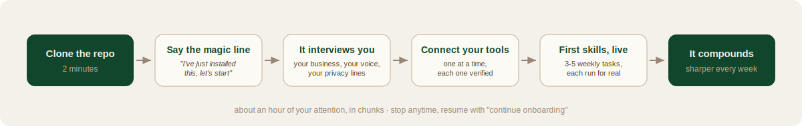
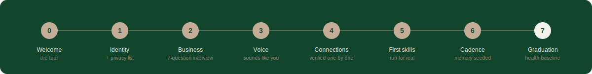
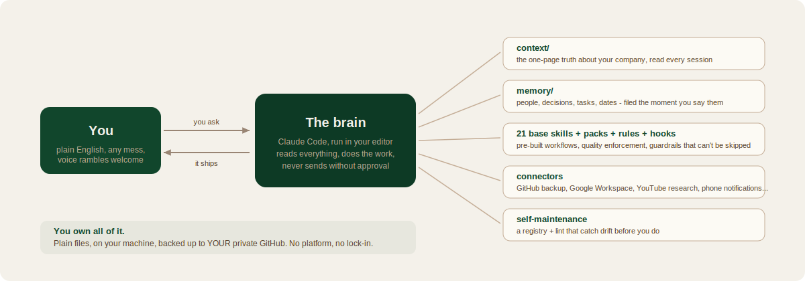

<p align="center">
  
</p>

<p align="center">
  <a href="LICENSE.md"></a>
  
  
  
</p>

# Imperium OS

An AI operating system for your company, installed in about an hour.

Imperium OS turns Claude Code into a system that knows your business, remembers everything you tell it, runs your repeat work through pre-built skills, and gets sharper every week you use it. You talk to it in plain English. It does the technical work.

It's the same system [Imperium Growth](https://imperium-growth.com) runs its own company on - packaged so the install is a conversation, not a project.

<p align="center">
  
</p>

## Install (the whole thing)

**1. Get the files.**
```
git clone https://github.com/Alexparkay/imperium-os.git my-company-os
```
Don't use git? Click the green **Code** button above → **Download ZIP** → extract it somewhere easy, like Documents.

**2. Open the folder in Claude Code** (the Claude Code app, or Cursor with Claude in it). Never used it? [docs/connectors/claude-code-install.md](docs/connectors/claude-code-install.md) gets you there in ten minutes. You'll want a Claude subscription - Max gives the system room to work all day.

**3. Type this into the chat:**
```
I've just installed this, let's start
```

That's the entire install. The system takes it from there: it interviews you one question at a time, writes itself around your business, plugs into your tools, and builds your first automations from your actual weekly grind. No coding knowledge. No terminal. It runs every command itself.

Get interrupted? Come back any day and type **"continue onboarding"** or **"where were we"** - it remembers exactly where you stopped, mid-question if needed.

## What onboarding looks like

<p align="center">
  
</p>

Eight short phases, one question at a time, about an hour of your attention in total. Whether you're a founder, a CEO with three ventures, a creative director inside someone else's company, or an operator with a portfolio of projects - the interview adapts: it asks whose company this is, which business is home base, and whether your public words go out as you or as the brand.

A live progress page ([docs/setup-status.html](docs/setup-status.html) - open it in your browser) shows where you are the whole way through.

## What's inside

<p align="center">
  
</p>

- **44 skills.** Pre-built workflows for content, research, client delivery, strategy, quality control, and more. Each one triggers automatically when you ask for something it covers.
- **A rule layer.** Enforcement rules that keep output quality high: no AI-sounding writing, no invented numbers, research before claims, disagreement before agreement. The system pushes back when you need it to.
- **A memory system.** Everything you tell it lands in the right file, immediately. People, decisions, deadlines, finances, ideas. Nothing lives only in a chat window.
- **Hooks.** Deterministic guardrails that run on every interaction, so the important rules cannot be skipped or forgotten.
- **A self-improvement loop.** A registry of every skill and rule, plus a lint tool that finds drift, dead paths, and stale config. You review, it fixes.
- **Connectors.** Step-by-step guides for plugging in GitHub backup, Google Workspace, YouTube research, Telegram notifications, and optional extras - each written for someone who has never opened a terminal, each verified with a real test before it counts as connected. (What we don't have yet, honestly listed: [docs/connectors/not-yet.md](docs/connectors/not-yet.md).)

## The folder, at a glance

| Folder | What it's for |
|---|---|
| `context/` | The one-page truth about your company. Read first, every session. |
| `memory/` | Everything the system learns: people, decisions, tasks, dates. |
| `clients/` | One folder per client engagement. |
| `content-pipeline/` | Drafts, published work, research, and your voice profile. |
| `automations/` | The runtime tools, like YouTube research and notifications. |
| `dashboard/` | The spec for your live company dashboard (built with you on request, once 2+ connectors are live - see dashboard/README.md). |
| `docs/` | Guides, the architecture explainer, and the setup status page. |

Everything else is plumbing. You never need to touch it.

## The safety posture

- **Nothing sends, posts, or spends without your approval.** Drafts wait in a queue; you approve, edit, or kill them.
- **Your keys stay on your machine** in one local settings file, excluded from backup by design.
- **A privacy list, set in minute five.** Anything you name - revenue, family, client names - never appears in any output, enforced by an always-on rule.
- **You own all of it.** Plain files, on your computer, backed up to your own private GitHub. Stop paying anyone tomorrow and the system still works.

## Battle-tested, not demo-tested

v0.2 was hardened by running two full overnight install simulations against real personas - an external multi-business CEO and an in-house creative director - with every bug adversarially verified before it was fixed. The onboarding survived mid-phase disconnects, hotel wifi, multi-company curveballs, and a skeptical owner who almost quit on day six. The fixes from those nights are in this repo.

## Support

First line of support is the chat itself: describe what happened in plain English and it will diagnose and fix most things on its own. The five-minute orientation lives at [docs/START-HERE.md](docs/START-HERE.md), the visual map at [docs/system-map.html](docs/system-map.html), and the engineering story at [docs/ARCHITECTURE.md](docs/ARCHITECTURE.md).

Want it installed for you, wired into your real stack (CRM, accounting, call transcripts, WhatsApp, dashboards), and tuned in person? That's what [Imperium Growth](https://imperium-growth.com) does.

---

<p align="center"><b>Imperium OS</b> · built by <b>Imperium Growth</b> · clone it, say hello, own your operating system</p>
